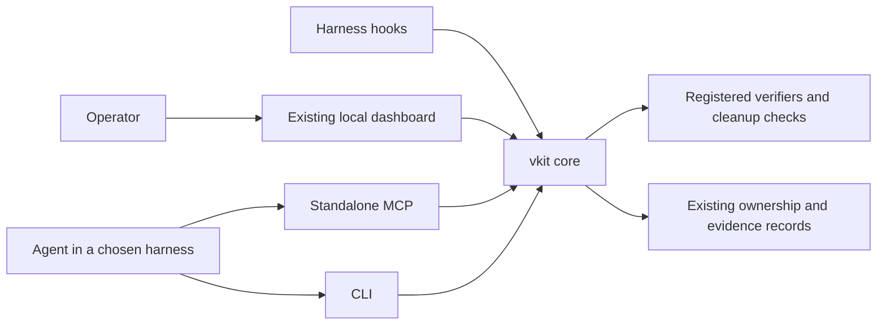

# Proposed contract extension for Plans 10-12

Status: implementation requirements approved for planning, not a claim of implemented behavior.
This document extends [CONTRACT.md](CONTRACT.md) for the next build. Preserve its existing ownership, process, source identity, and protected integration guarantees. Amend the stable contract and affected callers as each checkpoint lands. Do not label all plans complete by changing this document.

## One core, several ways to use it

The product is an installed vkit application. The operator uses a local web dashboard. Agents use MCP or the CLI. A harness plugin packages connection settings, optional skills, and supported lifecycle hooks.

Adapters expose the same decisions. Skills describe workflows. A plugin configures its host. Neither skills nor plugins become another acceptance authority.

## Exact claims and checked evidence

A PASS is always relative to a recorded claim and evidence kind. The agent cannot turn tested cases into a theorem by changing a label. Stronger requirements never silently downgrade when a tool is missing.

Specifications and their relation to intended behavior remain a trust boundary. Formal checking establishes a statement under its assumptions. It does not establish that the statement captures every user requirement. Implementation-to-model correspondence is a separate obligation.

Native verifiers reuse run ownership, cancellation, reports, and finalization. The same source, policy, fixture, generation, and claim identities must hold through acceptance. Existing integration verification continues to load approved verifier code and policy independently of the candidate.

## Automatic cleanup has a supported scope

An approved automatic cleanup mode permits only registered transformations whose independent preservation checks pass. Tests and model opinions cannot replace those checks.

Source inspection, tracing, compiler metadata, and external tools can make apparently inert edits observable. The app names the supported preservation scope and refuses unsupported claims. Every applied cleanup changes source identity and invalidates evidence for the earlier bytes.

## Operators can configure the application

The dashboard may read and propose validated project configuration. Specific guarded operations may save that configuration after a reviewable preview. This replaces the old console's blanket policy-write prohibition for those operations only.

Local configuration activation does not approve protected integration policy. Admitted tasks keep their pinned obligations. A settings edit cannot retroactively produce readiness.

## Portability and lifecycle limits

Standalone MCP and CLI remain usable without Claude or installed skills. Hook event formats and installation actions belong to each harness adapter. Where a host lacks lifecycle support, the app reports the missing automation rather than claiming automatic enforcement.

The dashboard remains a loopback server launched when requested. No permanent daemon, remote web deployment, or agent scheduler is required by these plans.

## Verification and delegation

Use small focused checks locally. Full suites, heavy formal runs, and browser acceptance run in GitHub CI. Use Python test drivers and avoid WSL.

Follow the user's current delegation policy. A paragraph in a plan does not itself authorize spawning agents. These plans are worker handoffs, and do not start worker sessions or install integrations on the user's machine.
