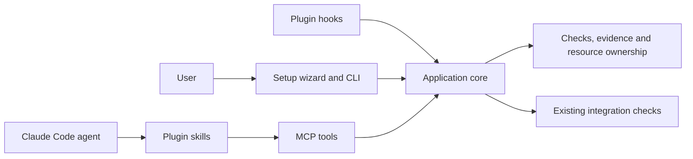

# Implementation plans for the verification app

Status: implementation handoffs prepared on 2026-09-29. No product implementation has begun. Working name: `vkit`; confirm package-name availability before publishing.

## Product decision

Build one installable local application. People use its setup wizard and CLI. Agents use its MCP tools through a Claude Code plugin. The plugin also carries workflow skills and lifecycle hooks. Every entry point uses the same application core and the same records.

MiniMax is the implementation engineer. The product has no model API dependency. Future users select their models in Claude Code. Here, "harness" means the agent application hosting the model and tools.

The app will offer to install or connect the required integration, show the proposed changes, and let the user choose installation scope. It will discover existing pstack skills and reuse them. It must not silently replace a user's skills or settings.

Start with a terminal setup wizard. A graphical interface is a presentation choice that can use this same core. The user has been asked which interface they want first; that answer can revise Plan 05 without changing Plans 01-04.

## Why this shape

| Option | Decision |
| --- | --- |
| Only Markdown skills and shell recipes | Insufficient for consistent evidence, ownership, installation, and recovery |
| Local app, CLI, MCP adapter, Claude plugin | Selected. Fits the requested experience and reuses the existing agent runtime |
| Permanent HTTP service and dashboard first | Defer. Requires service lifecycle, network access controls, and another UI before the core works |
| New agent scheduler or model gateway | Excluded. Claude Code already runs the agents |

The MCP server is a local stdio process started by the host. It can launch an owned verification process that outlives one MCP request. SQLite coordinates participating processes on one machine. This is not a distributed scheduler.



## Parts and dependencies

All plans below are written. "Ready after" means the named prerequisites must pass and their actual interfaces must be inspected before implementation starts. It does not require another research phase.

| Plan | Result | Execution readiness |
| --- | --- | --- |
| [01: executable verifier](01-verifier-core.md) | Installable CLI that runs a real check and preserves trustworthy outcomes | Start now |
| [02: ownership and run lifecycle](02-ownership-and-runs.md) | Resource claims, background runs, cancellation, and recovery | After 01 |
| [03: MCP interface](03-mcp-interface.md) | Agents invoke the app through a small typed tool set | After 02 |
| [04: Claude Code plugin](04-claude-plugin.md) | Skills, task binding, and fast lifecycle hooks | After 03 |
| [05: setup application](05-setup-app.md) | Guided install, repair, upgrade, and uninstall | After 04 |
| [06: repository onboarding](06-repository-onboarding.md) | Real feature maps and Python/Node examples | After 01; plugin acceptance after 04 |
| [07: integration and parallel workflow](07-integration-and-parallelism.md) | Combined-candidate checks and bounded engineering campaigns | After 02, 04, and 06 |
| [08: selected formal checks](08-formal-checks.md) | A defined ownership model and optional Lean demonstration | After 02; optional for the first release |
| [09: release and pilot](09-release-and-pilot.md) | Tested package, fresh-session install, and real pilot evidence | Package checks after 01-07; pilot needs the chosen repository and authorized live usage |

Read [the shared contract](CONTRACT.md) before any implementation plan. It defines stable meanings and public interfaces, not mandatory internal class structure.

## How to give a plan to the worker

Paste this, replacing the plan path:

```text
Implement plans/01-verifier-core.md. Read plans/CONTRACT.md and the relevant
sections of WORKER_WORKFLOW.md first. MiniMax is the builder; future users can
select any model. Complete this milestone end to end, including its acceptance
checks. Choose ordinary engineering details yourself. Do not implement later
milestones, weaken acceptance criteria, edit installed shared skills, or claim
checks that were not run. Inspect existing work before changing it.

Follow the repository's actual delegation policy. This handoff grants no new
permission to spawn agents. Return the implemented behavior, exact verification
commands and results, evidence paths, limitations, and any interface changes
the next milestone needs. Record completion in plans/STATUS.md only after the
milestone's acceptance criteria pass.
```

The plan directory and research files should be available in the worker's checkout. If only one document can be pasted, include CONTRACT.md followed by the selected plan. Do not ask the worker to infer requirements from conversation history.

## Implementation workflow and skills

Use `poteto-mode` for each complete engineering task, `ponytail` to avoid unnecessary mechanisms, and `unslop` for instructions and reports. Use `how` when inspecting existing code and `architect` for a disputed cross-module contract. The worker may load other relevant skills after reading their requirements.

Use `swarm` for an authorized batch of independent work. Use `git-worktree-discipline` for concurrent writers, applying the corrections in [WORKER_WORKFLOW.md](../tmp/research/WORKER_WORKFLOW.md#correct-the-existing-worktree-discipline). These are complementary. Worktrees do not isolate test databases or running applications.

Plan 01 needs one owner. After it passes, Plans 02 and 06 can overlap when fixture files, production modules, and shared dependency files have explicit owners. After Plan 03, one owner implements Plan 04. Plan 05 follows the actual plugin layout. Do not parallelize all nine plans against guessed interfaces.

Each owner carries its task through inspection, implementation, debugging, and evidence. One integration owner merges serially and runs the combined checks. Keep workers attached for repair instead of creating a new agent for every stage. `arena` is for justified competing designs; `interrogate` is for consequential review. Neither is routine ceremony.

## Definition of completion

A milestone is complete when its acceptance commands run on the actual candidate, expected failure cases fail for the expected reason, artifacts remain readable, and limitations are recorded. A stubbed CLI, mocked MCP transcript, green import test, or worker narrative is insufficient.

If a prerequisite fails, repair it within its ownership boundary or return a concrete blocker. Ordinary implementation choices belong to the engineer. Changes to product scope, public semantics, or required evidence must be surfaced rather than hidden in fallback code.

Research background: [architecture](../tmp/research/KIT_RESEARCH.md), [acceptance matrix](../tmp/research/KIT_ACCEPTANCE.md), and [skill routing](../tmp/research/WORKER_WORKFLOW.md).

## Acceptance ownership

The full research acceptance matrix remains controlling. These owners prevent a check from disappearing between milestones:

| Acceptance area | Owning plans |
| --- | --- |
| Valid outcomes, missing/empty reports, source freshness, logs | 01 |
| Process descendants, cancellation, crash recovery, storage failures | 01 and 02 |
| Claims, retries, stale attempts, registered capacity | 02 |
| Cross-project IDs, bounded tool output, reconnect/idempotency | 03 |
| Hook failures, fresh context, internal agents, missing skills | 04 |
| Install scope, path handling, updates, preservation of user settings | 05 |
| Feature coverage, driver drift, real application interaction | 06 |
| Combined changes, moved base, policy tampering, coordinator recovery | 07 |
| Model-check bounds, incomplete proofs, optional tool absence | 08 when enabled |
| Two models, fresh installation, real pilot, measured scale limits | 09 |

This table assigns responsibility; it does not mark any implementation check as passed.

## Current integration sources

- [Official MCP Python SDK](https://github.com/modelcontextprotocol/python-sdk): use the maintained SDK; pin the version actually tested.
- [MCP transports](https://modelcontextprotocol.io/specification/2025-11-25/basic/transports): use stdio initially; stdout is reserved for protocol messages.
- [Claude Code MCP integration](https://code.claude.com/docs/en/mcp): plugins can bundle MCP servers and connect them when enabled.
- [Claude plugin manifest](https://code.claude.com/docs/en/plugins-reference): package skills, hooks, and MCP configuration together.

These sources were inspected during planning. Record installed host and SDK versions during implementation; do not assume future documentation exactly matches the installed host.
