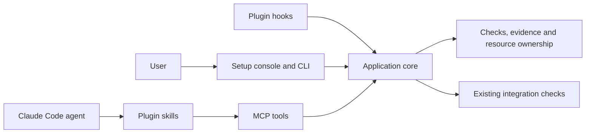

# Implementation plans for the verification app

These are the plans the product was built from. Every milestone has been
executed. What each file still carries is the decision that milestone made: the
acceptance contract its "done" meant, and the choices that the code alone
cannot explain. Per-milestone status and evidence live in
[STATUS.md](STATUS.md).

The plans are not user documentation. A user reads the root `README.md`. A
maintainer changing the product reads the code. These files exist so a reviewer
can see what was asked for and what was decided, not so anyone can reconstruct
the implementation from them.

## Product decision

Build one installable local application. People use its setup wizard and CLI.
Agents use its MCP tools through a Claude Code plugin. The plugin also carries
workflow skills and lifecycle hooks. Every entry point uses the same application
core and the same records.

The product has no model API dependency. Future users select their models in
Claude Code. "Harness" here means the agent application hosting the model and
tools.

The app offers to install or connect the required integration, shows the
proposed changes, and lets the user choose installation scope. It discovers
existing pstack skills and reuses them. It must not silently replace a user's
skills or settings.

## Why this shape

| Option | Decision |
| --- | --- |
| Only Markdown skills and shell recipes | Insufficient for consistent evidence, ownership, installation, and recovery |
| Local app, CLI, MCP adapter, Claude plugin | Selected. Fits the requested experience and reuses the existing agent runtime |
| Permanent HTTP service and dashboard first | Deferred. Requires service lifecycle, network access controls, and another UI before the core works |
| New agent scheduler or model gateway | Excluded. Claude Code already runs the agents |

The MCP server is a local stdio process started by the host. It can launch an
owned verification process that outlives one MCP request. SQLite coordinates
participating processes on one machine. This is not a distributed scheduler.

## The milestones

"Ready after" is the order they were built in, not the order they were written
in. The build order the owner actually agreed is recorded in
[STATUS.md](STATUS.md#build-order-agreed-with-the-owner-2026-09-29); it differs
from this table, because ownership and onboarding were needed before the
interfaces the later plans assumed.

| Plan | Result | Ready after |
| --- | --- | --- |
| [01: executable verifier](01-verifier-core.md) | Installable CLI that runs a real check and preserves trustworthy outcomes | nothing |
| [02: ownership and run lifecycle](02-ownership-and-runs.md) | Resource claims, background runs, cancellation, and recovery | 01 |
| [03: MCP interface](03-mcp-interface.md) | Agents invoke the app through a small typed tool set | 02 |
| [04: Claude Code plugin](04-claude-plugin.md) | Skills, task binding, and fast lifecycle hooks | 03 |
| [05: setup application](05-setup-app.md) | Guided install, repair, upgrade, and uninstall | 04 |
| [06: repository onboarding](06-repository-onboarding.md) | Real feature maps and Python/Node examples | 01; plugin acceptance after 04 |
| [07: integration and parallel workflow](07-integration-and-parallelism.md) | Combined-candidate checks and bounded engineering campaigns | 02, 04, and 06 |
| [08: selected formal checks](08-formal-checks.md) | A defined ownership model and optional Lean demonstration | 02; optional for the first release |
| [09: release and pilot](09-release-and-pilot.md) | Tested package, fresh-session install, and real pilot evidence | Package checks after 01-07; the pilot needs a chosen repository and authorized live usage |

[CONTRACT.md](CONTRACT.md) defines the stable meanings and public interfaces the
plans share. It outranks any plan that disagrees with it, and roughly twenty
source files cite it by name.

## Acceptance ownership

Each acceptance area had an owning plan. This assigns responsibility; it does not
mark any check as passed. Whether a check passed is in STATUS.md.

| Acceptance area | Owning plans |
| --- | --- |
| Valid outcomes, missing/empty reports, source freshness, logs | 01 |
| Process descendants, cancellation, crash recovery, storage failures | 01 and 02 |
| Claims, retries, stale attempts, registered capacity | 02 |
| Cross-project IDs, bounded tool output, reconnect/idempotency | 03 |
| Hook failures, fresh context, internal agents, missing skills | 04 |
| Install scope, path handling, updates, preservation of user settings | 05 |
| Feature coverage, driver drift, real application interaction | 06 |
| Combined changes, moved base, policy tampering, coordinator recovery | 07 |
| Model-check bounds, incomplete proofs, optional tool absence | 08 when enabled |
| Two models, fresh installation, real pilot, measured scale limits | 09 |

Plan 02's acceptance table is not only a record.
`tests/test_acceptance02.py` parses it and requires each exercise to appear
verbatim as the title of a row in `scripts/acceptance02.py`, so a row added to the
plan and not to the harness fails a test. Editing that table breaks the harness.

## Definition of completion, as it was applied

A milestone is complete when its acceptance commands run on the actual candidate,
expected failure cases fail for the expected reason, artifacts remain readable,
and limitations are recorded. A stubbed CLI, mocked MCP transcript, green import
test, or worker narrative is insufficient. This is the standard the code was
held to, and the standard each STATUS.md row claims.

## Research material

The planning research these plans were written from is not in this repository.
`tmp/*` is gitignored, and no clone carries it. Where a plan referenced
`tmp/research/`, that reference is marked here instead:

- Plan 06 and Plan 07's research base has no surviving copy.
- The acceptance matrix Plan 09 maps row by row was superseded by
  [docs/ACCEPTANCE-MATRIX.md](../docs/ACCEPTANCE-MATRIX.md), which is tracked.
- The workflow corrections Plan 07 cited live in the `git-worktree-discipline`
  skill, which is installed rather than committed.

## Sources inspected during planning

- [Official MCP Python SDK](https://github.com/modelcontextprotocol/python-sdk)
- [MCP transports](https://modelcontextprotocol.io/specification/2025-11-25/basic/transports)
- [Claude Code MCP integration](https://code.claude.com/docs/en/mcp)
- [Claude plugin manifest](https://code.claude.com/docs/en/plugins-reference)

Installed host and SDK versions are recorded in STATUS.md and in
`docs/RELEASE-CHECKLIST.md`, not here. Planning-time documentation does not
describe the installed host.
